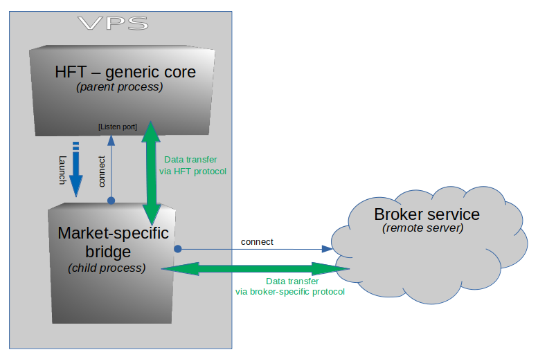

# HFT version 3

HFT is an experimental project aimed at financial analysis
Leveraged markets in terms of their ineffectiveness as well as testing various
investment strategies.  
Currently dedicated only to Linux distribution CentOS 7.

## Table of Contents
* [Preface](#Preface)
* [The content of the repository](#The-content-of-the-repository)
* [A brief description of the program architecture](#A-brief-description-of-the-program-architecture)
* [Quick start](#Quick-start)
* * [Building the project](#Building-the-project)
* * [Installation and configuration](#Installation-and-configuration)
* * [Environmental details](#Environmental-details)
* * [Example: Playing EUR/USD with the Dukascopy broker](#Playing-EURUSD-with-the-Dukascopy-broker)
* [HFT generic core internals](#HFT-generic-core-internals)

## Preface

The prices of stocks in ineffective markets are characterized by trends.
This project is a trading robot enriched with some tools for
market analysis based on historical data. General principle of operation
it comes down to trying to detect a medium to long term trend and invest accordingly.
A dynamic controller with hysteresis is used to try to detect it.
You can try to determine the settings of the regulator for a given financial instrument
based on historical data for this instrument.

The project is experimental and is not meant to be defined
a specific investment strategy in advance.

## The content of the repository

The purpose of the individual project directories is described in general below.

<br><table>
    <tr>
        <td><strong>3rd_party</strong></td><td>Third party libraries used for build hft</td>
    </tr>
    <tr>
        <td><strong>bdm</strong></td><td>DEPRECATED. BitMEX Data Manager - utility for acquiring historical data from BitMEX servers.</td>
    </tr>
    <tr>
        <td><strong>bitmex-bridge</strong></td><td>Script written in PHP. Can be run as a intermediary process by hft-server (if configured). It handles BitMEX broker</td>
    </tr>
    <tr>
        <td><strong>dukascopy-bridge</strong></td><td>Program written in Java. Can be run as a intermediary process by hft-server (if configured). It handles Dukascopy broker</td>
    </tr>
    <tr>
        <td><strong>caans</strong></td><td>Auxiliary service written in C++ for sending SMS. It is use to me for monitoring whether hft-server is up & running or dead on VPS</td>
    </tr>
    <tr>
        <td><strong>etc</strong></td><td>Miscellaneous files</td>
    </tr>
    <tr>
        <td><strong>hft</strong></td><td>HFT written in C++. It is hft-server, emulator and other utils. Compilation produces single binary file `hft` </td>
    </tr>
    <tr>
        <td><strong>rpm-gen</strong></td><td>Simply infrastructure for generate RPM package of HFT. Currently only for CentOS 7</td>
    </tr>
</table><br>

## A brief description of the program architecture

The project includes:

* hft-server - Trading Expert Advisor, running as a service
* a set of additional auxiliary tools for various processing of CSV files with market data, as well as an emulator simulating a broker
* intermediary programs that allow you to connect with brokers to play on the market (currently only Dukascopy&#174; and BitMEX&#174;)

The main component is the hft-server (called also *HFT generic core*), i.e. the logical control - Trading Expert Advisor - in the form of a service that reads data sent either from the emulator or
from the intermediary process (called also *Bridge* or *Market-specific bridge*). An intermediary process is a running program that connects to both the broker using its API,
and with the hft-server process, providing the latter with market data. In response, hft-server passes the response to the process
intermediary who passes it on to the broker to conclude a specific transaction on the market.
The hft-server service is therefore independent of the broker API. The hft-server service is intended to implement only business logic,
while the intermediary process acts as an proxy between the hft-server and the broker's trading service and its only task is
translation of the broker API into the communication protocol used by hft-server.

The way of interaction between the hft-server, the intermediary process and the broker is shown in the figure below:

 

It is also worth mentioning that there is no limit to the number of intermediary processes running simultaneously. Thanks to that
it is possible to play on multiple markets simultaneously.

As described at the beginning, instead of the intermediary process which, together with hft-server, plays on the market in real time,
it is also possible to connect an emulator. An emulator is a program that connects to and communicates with the hft-server
using the HFT protocol, but does not connect to the broker to retrieve data from the market. Instead, it reads the market data
from the CSV file and sends them to the hft-server and emulates the broker operation itself, i.e. opens and closes positions as well as updates the account status.
It is convenient for testing the strategy with historical data.


## Quick start

At this point, we will discuss the topic of compiling and running HFT as soon as possible step by step. Finally, as an example, we will configure the HFT to play the EUR/USD instrument with the Dukascopy broker on a demo account.
Please note, that the topics will be discussed very briefly since a more detailed discussion is beyond the scope of this README document.

### Building the project

The recommended way to build a project is to build an RPM package for CentOS 7.
For this purpose, any Linux distribution and Docker installed are required. Here's how:

    $ cd rpm-gen
    $ ./rpm-gen.sh hft-system

Note that the first script run will take a long time due to
on the need to create a Docker image with a compilation of the necessary libraries inside it.

If the script accomplishes, you will find the generated RPM package in the directory:

    $ ls exchange/RPMS/
    hft-system-3.0.0-0_1.el7.x86_64.rpm

### Installation and configuration

The above file should be copied to the Centos7 machine. Make sure your CentOS 7 system has access to the repository containing the `nodejs` package. You can install it manually for a try:

    $ sudo yum install -y nodejs

When everything is successful, just install the hft-system package:

    $ sudo yum localinstall -y hft-system-3.0.0-0_1.el7.x86_64.rpm

If the installation went smoothly, you can start HFT by typing `hft` in the terminal.

    $ hft
    High Frequency Trading System - Professional Expert Advisor
    Copyright  2017 - 2021 by LLG Ryszard Gradowski, All Rights Reserved.

    Usage:
      hft <tool> [tool options]

    Available tools:
      hftr-generator            generate hftr record file based on Dukascopy
                                .csv history data

      hftr-mixer                generates new HFTR file based on original, by
                                randomly mixing records order

      hci-tuner                 finds optimal settings for HCI regulator
                                optimizing specified indicator

      ai-trainer                proceed train AI predictor's neural networks

      serial-analyzer           serial distribution analyzer for instrument

      bcalc                     Bernouli Calculator - calculates correct
                                prediction probability of set of defined amount
                                predictors

      instrument-distrib        obtain instrument variability distribution

      distrib-approx-generator  generate binomial distribution approximation
                                based on instrument variability distribution

      dukascopy-optimizer       Kelly criterion optimizer for Dukascopy

      fxemulator                HFT TCP Client emulates Dukascopy forex trading
                                platform using dukascopy historical CSV data

      server                    HFT Trading TCP Server. Expert Advisor for
                                production and testing purposes


As you can see above, the program displayed the list of available tools and exited. At this point, we will not focus on discussing each of them, but say a few words about the last of them, i.e. the server.

At this point, you can easily start hft-server (i.e. *HFT generic core*) by simply typing:

    $ sudo hft server

The program will launch in foreground mode based on its default configuration and will do nothing but listen on the default TCP port.
Also, no default intermediary program will start because the default configuration starts standalone hft-server.
To run it in a daemon mode, type this:

    # systemctl start hft

To stop it later, type:

    # systemctl stop hft

### Environmental details

At this point, I will tell you about some important locations in the system on which the HFT is installed.
There are three key directories to keep in mind:

  * `/etc/hft/`
  * `/var/lib/hft/`
  * `/var/log/hft/`

The `/etc/hft` directory contains all HFT related configurations,  
The `/var/lib/hft` directory contains runtime data and intermediary programs along with their libraries,  
The `/var/log/hft` directory contains the following logs: `server.log` and `bridge.log`.  

HFT generic core (hft-server) writes to the `server.log`, while intermediary programs write to `bridge.log`.  

The most important hft-server configuration file is the `/etc/hft/hftd.conf` file.

### Example: Playing EUR/USD with the Dukascopy broker

#### Step 1.

Edit file `/etc/hft/hftd.conf`, find section `[marketplace]`, then setup attribute `enabled` to `true`. This tell hft-server to start with child process.

#### Step 2.

Edit file `/etc/hft/bridges.json`, for `"dukascopy"` change `"active"` to `true`. This determines which process should be started and how.

#### Step 3.

Now configure how the HFT generic core should handle the EUR/USD instrument:

    $ # Create directory for instrument handler.
    $ sudo mkdir /etc/hft/EURUSD

    $ # Create dummy neural network. The neural network
    $ # will now not be included in the operation, but must be defined.
    $ # This necessity will most likely be eliminated in a future release.
    $ touch /tmp/dummy.hftr
    $ sudo hft ai-trainer --train-hftr-file=/tmp/dummy.hftr --network-file=/etc/hft/EURUSD/dummynet.json -s 0.01:1

    $ # Create dummy approximation file (unused, but must be)
    $ sudo echo '{"n" : 100, "distribution" : { "1" : 10 } }' > /etc/hft/EURUSD/approx.json

    $ # Create main config for instrument handler - manifest.json
    $ sudo touch /etc/hft/EURUSD/manifest.json

Insert the following into the `/etc/hft/EURUSD/manifest.json` file:
```
{
    "eav": 1,
    "rule": "<-1, 1>=long",
    "architecture": "[7]",
    "networks": [
        "dummynet.json"
    ],
    "vote_ratio": 0.997,
    "collector_size": 2,
    "dpips_limit_profit": 900,
    "dpips_limit_loss": 900,
    "binomial_approximation": "approx.json",
    "granularity": 1,
    "position_control_policy": {
        "model": "basic"
    },
    "custom_handler_options": {
        "invert_engine_decision": true
    },
    "hysteresis_compensate_inverter": {
        "capacity": 13,
        "s_threshold": -21,
        "i_threshold": -13
    }
}
```

#### Step 4.

[Open JFOREX demo account in Dukascopy&#174;](https://www.dukascopy.com/europe/english/forex/demo-fx-account/).

#### Step 5.

Create configuration for intermediary process. The intermediary process (*bridge*) must inform the broker's server which financial instruments it intends to play. He must also authorize himself to the broker. Therefore, this information should be put in the configuration file `dukascopy-bridge-config.json`

    $ sudo touch /etc/hft/dukascopy-bridge-config.json

Insert the following into the `/etc/hft/dukascopy-bridge-config.json` file:

```
{
    "mode" : "demo",

    "authorization":
    {
        "username" : "XXXXXXXXXXX",
        "password" : "YYYYYYYYYYY"
    },

    "EURUSD" :
    {
        "investition_policy":
        {
            "model" : "const_units",
            "amount" : 3000
        },

        "hard_stoploss" : 0
    }
}

```

Replace XXXXXXXXXXX and YYYYYYYYYYY with the username and password, respectively, that you received on your email when registering a demo account in Step 4.

All that's left is to run the HFT:

    $ sudo systemctl start hft

## HFT generic core internals

To be continued...  
  
